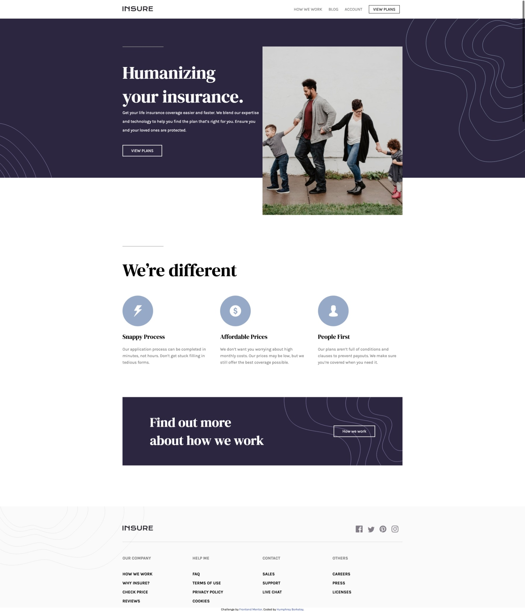

# Frontend Mentor - Insure landing page

## Description

- This project is my solution to Frontend Mentor's Insure landing page design challenge.
- Optimized for desktop (1440 px) and mobile (375 px)

## Technologies

- HTML
- CSS
- JavaScript

## Solution

## Links

- Live solution url: [Click here](https://borteyhumphrey.github.io/insureLandingPage/)
